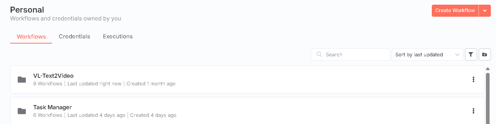

# Task Manager N8N

A powerful, low-code orchestration system built with n8n workflows for managing asynchronous and long-running tasks. This solution enables you to track external jobs (ML processes, data pipelines, API integrations, AI workflows) with automated polling, status updates, and real-time monitoring through a React frontend.

## Requirements

### n8n (Cloud or Self-Hosted)
- **n8n Cloud** (recommended for quick start) or **n8n Community Edition** (self-hosted)
- The free tier of n8n Cloud is sufficient for testing and small-scale deployments
- **How to get started with n8n Cloud:**
  1. Visit [n8n.io](https://n8n.io)
  2. Click "Start free trial" (14-day trial, then free tier available)
  3. Create your account with email or Google/GitHub login
  4. Your n8n instance will be ready immediately at `your-name.app.n8n.cloud`

### Supabase Database
- A Supabase project for storing task data
- The **free tier is sufficient** (includes 500MB database, unlimited API requests)
- **How to create a Supabase account:**
  1. Go to [supabase.com](https://supabase.com)
  2. Click "Start your project" and sign up with GitHub or email
  3. Create a new project (choose a region close to your users)
  4. Save your project URL and API keys from Settings → API
  5. The database will be ready in ~2 minutes

## Database Setup

### 1. Import the Database Schema
Once your Supabase project is ready:
1. Go to the SQL Editor in your Supabase dashboard (left sidebar)
2. Click "New query"
3. Copy and paste the contents of `sql/000_initial_task_manager_migration.sql`
4. Click "Run" to create the table and security policies


### 2. Get Supabase Credentials

#### For Frontend (React App)
1. In Supabase dashboard, go to Settings → API
2. You'll need:
   - **Project URL**: `https://your-project.supabase.co`
   - **Anon Public Key**: Safe to use in frontend apps
3. Create a `.env` file in the `frontend/` directory:
   ```env
   REACT_APP_SUPABASE_URL=https://your-project.supabase.co
   REACT_APP_SUPABASE_ANON_KEY=your-anon-public-key
   ```


#### For n8n (PostgreSQL Connection)
1. In Supabase dashboard, go to Settings → Database
2. You'll need the connection details:
   - **Host**: Your project database host
   - **Database name**: `postgres`
   - **Port**: `5432`
   - **User**: `postgres`
   - **Password**: Your database password (shown once during project creation)


3. In n8n, create a new PostgreSQL credential with these details

## n8n Workflow Setup

### 1. Create a Folder for Organization
1. In your n8n dashboard, click on "Workflows" in the left sidebar
2. Click the folder icon to create a new folder
3. Name it "Task Manager" (or any name you prefer for organization)
4. This helps keep your task management workflows separate from other automations



### 2. Import Task Manager Workflows
1. Navigate to your Task Manager folder
2. Import the following workflow files from the `TaskManager/` directory:
   - `N8N_Task_Creation_Workflow.json` - Creates new tasks via webhook
   - `N8N_Task_Monitor_Workflow.json` - Monitors and updates task status
   - `N8N_Get_Status_Query_Workflow.json` - Query task status endpoint
   - `N8N_Task_Update_Workflow.json` - Manual task updates via webhook
   
3. To import each workflow:
   - Click "Add workflow" → "Import from File" 
   - Select the JSON file
   - The workflow will open in the editor

4. After importing, you'll need to:
   - Update the PostgreSQL credentials in each workflow
   - Activate each workflow (toggle the "Active" switch)
   - Note the webhook URLs for your API endpoints

### 3. Configure and Test Task Manager Nodes
1. Open the `N8N_Task_Manager_Nodes.json` workflow
2. Find the URL node in the workflow
3. Update the URL to point to your n8n instance:
   - If using n8n Cloud: `https://your-name.app.n8n.cloud/webhook/xxx`
   - If self-hosted: `https://your-domain.com/webhook/xxx`


4. Test the setup:
   - Click on the `TM_SIMPLE_NODE` 
   - Click "Execute Node" to run it manually
   - You should receive a TaskID response like: `2d9c4c2e-c39a-4da2-aaad-2cd096e2009d`
   - This confirms your Task Manager is working correctly


5. If successful, the task will be created in your Supabase database
   - You can verify this in Supabase Table Editor → task_manager table

## Demo Workflows - AI Creative Automation

### 1. Import Demo Workflows
Create a separate folder for the demo workflows to see Task Manager in action:

1. Create a new folder in n8n called "AI Creative Demo" (or similar)
2. Import the following workflows from the `DemoVideoCreation/` directory:
   - `01__VL__Form_submission.json` - User input form for creative parameters
   - `02__VL__Image_Generation.json` - AI image generation with OpenAI
   - `03__VL__Video_Creation.json` - Video animation with Kling
   - `04__VL__Audio.json` - Text-to-speech with ElevenLabs
   - `05__VL__Lipsync_Creation.json` - Lipsync video generation

### 2. Understanding the Demo Architecture
These workflows demonstrate a complete AI creative pipeline that:
- Accepts user input (image description, style, voice)
- Generates images using AI
- Creates animated videos
- Produces voice narration
- Combines everything into a lipsync video

**Watch the full explanation**: [YouTube Tutorial - Task Manager Demo](https://www.youtube.com/watch?v=PckWZW2fhwQ)

### 3. Required API Credentials for Demo
To run the demo workflows, you'll need:
- **OpenAI API** - For image generation
- **ElevenLabs API** - For text-to-speech ([Get started here](https://try.elevenlabs.io/ruugnmjj7522))
- **PiAPI** - For Kling video generation ([Sign up here](https://piapi.ai/workspace?via=valics))
- **FAL API** - For Tavus lipsync

Note: These are optional - the core Task Manager works without them

## Frontend Application (Optional)

### Running the Task Monitor UI
If you want a visual interface to monitor your tasks:

1. Navigate to the `frontend/` directory
2. Check the `frontend/README.md` for detailed setup instructions
3. Quick start:
   ```bash
   cd frontend
   npm install
   npm start
   ```
4. The React app will run locally at `http://localhost:3000`

### Features
- Real-time task status monitoring
- Visual display of task results (images, videos, audio)
- Running time tracking for active tasks
- Auto-refresh for live updates
- Supabase real-time subscriptions

Note: Make sure you've configured the `.env` file with your Supabase credentials before starting

## Task Manager Node Configuration

### Important: Webhook URL Configuration

When setting up Task Manager nodes in n8n workflows, it's crucial to verify and update the webhook URLs in trigger nodes:

1. **Create Task Webhook**
   - Default pattern: `webhook/create-task`
   - Used in the Create Task workflow

2. **Update Task Webhook (SetStatus)**
   - Pattern: `webhook/{UUID}/update-task/`
   - Example: `webhook/ade4dfea-d284-4c02-95f0-4deeb1435983/update-task/`
   - **IMPORTANT**: Check and update the UUID in your workflow - it may differ from the example

3. **Get Status Webhook (GetStatus)**
   - Pattern: `webhook/{UUID}/task-status/`
   - Example: `webhook/2d9c4c2e-c39a-4da2-aaad-2cd096e2009d/task-status/`
   - **IMPORTANT**: Check and update the UUID in your workflow - it may differ from the example

### Step 1: Verify Webhook URLs
Before using any Task Manager workflow:
1. Open each webhook trigger node
2. Check the webhook URL path
3. Update the UUID portion if needed to match your n8n instance
4. Ensure the webhook is active and accessible

## Creating Tasks with Proper Configuration

When setting up a Create Task workflow, it's essential to include two key parameters for proper task identification and tracking:

### Required Parameters

1. **task_type** - A descriptive identifier for the type of operation
   - Examples: `"image_creation"`, `"video_creation"`, `"excel_file_extract"`, `"data_processing"`
   - This helps categorize and filter tasks in monitoring

2. **external_id** - A unique identifier for the entire job
   - Must be unique across all tasks
   - Used to track a job through multiple stages

### Generating Unique External IDs

Use the `GenerateUniqueID` code node from the demo workflows to create random 16-character alphanumeric IDs:

```javascript
// Generate random 16-character alphanumeric string and assign it to 'external_id'
for (const item of $input.all()) {
    item.json.external_id = [...Array(16)]
        .map(() => Math.random().toString(36)[2])
        .join('');
}

return $input.all();
```

### Example Task Creation Request

```json
{
  "task_type": "excel_file_extract",
  "external_id": "a7b3x9m2p5q8r1t6",
  "poll_url": "https://api.example.com/status/job123",
  "max_attempts": 10
}
```

This configuration ensures your tasks are properly categorized and can be tracked throughout their lifecycle.

### Important: Task Status Management

The Task Manager system uses five status values to track task lifecycle:

- **pending** - Initial status when a task is created
- **in_progress** - Task is actively being processed
- **completed** - Task finished successfully
- **failed** - Task encountered an error and failed
- **cancelled** - Task was manually cancelled by user

After creating a task, it's crucial to immediately update its status to `in_progress` before starting the actual workflow. This two-step process ensures proper task tracking:

1. **Create the task** - The task is created with `pending` status
2. **Update to in_progress** - Use the Update Task webhook to set status to `in_progress`
3. **Execute your workflow** - Now start the actual work (API calls, processing, etc.)
4. **Final status update** - Set to `completed` on success or `failed` on error

This pattern prevents tasks from appearing stalled and provides accurate monitoring of active work.

#### Example Status Updates

After receiving a task_id from task creation:
```json
POST /webhook/{task-id}/update-task/
{
  "status": "in_progress"
}
```

On successful completion:
```json
POST /webhook/{task-id}/update-task/
{
  "status": "completed",
  "result": {
    "output_url": "https://example.com/result.pdf",
    "processing_time": "2m 34s"
  }
}
```

On failure:
```json
POST /webhook/{task-id}/update-task/
{
  "status": "failed",
  "error": "API rate limit exceeded"
}
```

### Task Completion Node Group

To simplify task status updates at the end of your workflows, you can use a standardized node group that handles the final status update. This group consists of 5 connected nodes:

1. **OutsideJSON** - Sets the status to "completed"
2. **InsideJSON** - Collects all task results and metadata
3. **CreateJSON** - Merges the status and results into a single JSON payload
4. **TM_SetStatus_COMPLETE** - Updates the task status via the webhook
5. **TriggerWorkflow** - Optionally triggers the next workflow in a chain

#### Node Group Structure

The node group performs these operations:

1. **Prepare Status** (OutsideJSON node):
   ```json
   {
     "status": "completed"
   }
   ```

2. **Collect Results** (InsideJSON node):
   - Gathers all relevant data from your workflow
   - Includes task_id and any output data (URLs, metadata, etc.)

3. **Merge Data** (CreateJSON node):
   - Combines status and results into the required format:
   ```json
   {
     "status": "completed",
     "result": {
       "task_id": "xxx",
       "output_url": "https://...",
       "processing_time": "2m 15s",
       // ... other results
     }
   }
   ```

4. **Update Task Status** (TM_SetStatus_COMPLETE node):
   - Makes a POST request to the update-task webhook
   - Requires authentication credentials
   - URL pattern: `webhook/{UUID}/update-task/{task_id}`

5. **Trigger Next Workflow** (TriggerWorkflow node):
   - After updating the task status, call the next workflow in your pipeline
   - Use CreateTask endpoint for the next workflow
   - Pass the current `task_id` and `external_id` for easy identification
   - Example request:
   ```json
   POST /webhook/create-task
   {
     "TaskID": "{{ $json.task_id }}",
     "external_id": "{{ $('Webhook').item.json.body.external_id }}",
     "task_type": "next_processing_step"
   }
   ```

This node group ensures consistent task completion across all workflows and makes it easy to chain multiple workflows together while maintaining traceability through the external_id.

## Support & Community

For questions, support, or discussions about this project:

- **GitHub**: Open an issue in this repository
- **Community Forum**: [RoboNuggets on Skool](https://www.skool.com/robonuggets/about?ref=eab1a6d8a1aa4769b1979373715509a2)
- **Free Community**: [RoboNuggets Free on Skool](https://www.skool.com/robonuggets-free/about?ref=eab1a6d8a1aa4769b1979373715509a2)
