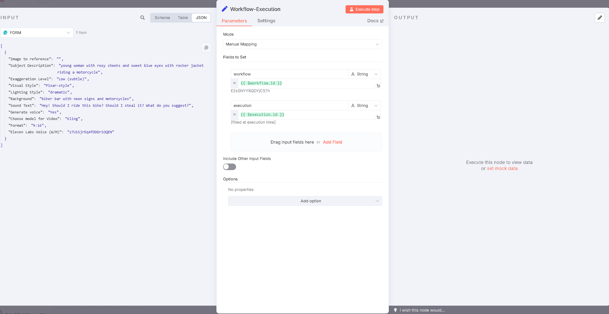

# Setup Nodes for n8n Task Manager Workflows

This guide explains how to set up the Task Manager nodes in your n8n workflows. The Task Manager system consists of multiple workflows that work together to manage asynchronous tasks.

## Workflow Structure Overview

The Task Manager uses a series of connected workflows:
- **Workflow 1**: Initial setup and triggering
- **Workflows 2-n**: Sequential task processing workflows

## Workflow 1: Initial Setup

This workflow prepares and triggers subsequent workflows. The easiest approach is to copy the full red sticky notes with nodes from the demo workflow.

### Step 1: Workflow Execution Node

Add a **Workflow-Execution** node to capture the workflow and execution ID for dashboard debugging.



### Step 2: Generate Unique ID

Configure the **GenerateUniqueID** node:
- **PREFIX**: Add a prefix for your unique identifier (optional)
- **WEBHOOK_URL**: Your n8n instance URL
- **WEBHOOK_URL_TASKMAN**: Task Manager URL (use same as WEBHOOK_URL if not different)


### Step 3: TM_SIMPLE_NODE Configuration

Configure the **TM_SIMPLE_NODE** with:

1. **Header Authentication** (Required):
   - Set up credentials in Task Manager module first
   - Configure header auth to secure Task Manager authentication
   - Without proper auth setup, you'll get errors

2. **Required Variables** (pass these 4 variables):
   ```json
   { 
     "workflow": "{{ $('Workflow-Execution').item.json.workflow }}", 
     "execution": "{{ $('Workflow-Execution').item.json.execution }}",
     "webhook_url": "{{ $('GenerateUniqueID').item.json.webhook_url}}",
     "webhook_url_taskman": "{{ $('GenerateUniqueID').item.json.webhook_url_taskman}}"
   }
   ```

3. **task_type**: Set a descriptive name for your workflow type (e.g., `image_processing`, `data_validation`, `social_media_posting`)


### Step 4: Add Your Custom Logic

After the TM_SIMPLE_NODE, add your workflow-specific nodes. Keep workflows focused on single tasks:

**Example Task Breakdown:**
- Task 1 (Workflow 1): Generate prompt with AI
- Task 2 (Workflow 2): Generate image from prompt
- Task 3 (Workflow 3): Generate audio from prompt
- Task 4 (Workflow 4): Merge audio with video
- Task 5 (Workflow 5): Publish to social media

### Step 5: Complete the Workflow

At the end of your workflow, set up the completion nodes:

1. **OutsideJSON**: Creates success note (no modification needed)

2. **InsideJSON**: Critical node for data aggregation
   - Collects all responses and messages into one JSON
   - Must include `task_id` (don't modify)
   - Add output from your nodes (e.g., `output.Form`)
   - For multiple node outputs, merge them first


3. **CreateJSON**: Only modify if adding extra data to InsideJSON

4. **TM_SetStatus_COMPLETE**: Marks task as complete
   - Usually no modification needed
   - If multiple entries cause failure, change item to `first()`

5. **Trigger Next Workflow**: 
   - Change `/webhook/ImageCreation` to your next workflow's endpoint
   - Ensure next workflow has matching webhook name (e.g., `ImageCreation`)
   - Next workflow must use POST method

## Workflows 2-n: Sequential Processing

### Step 1: Webhook Setup

Add a **Webhook** node:
- Name: Must be "Webhook" (exact name)
- Method: POST
- Path: Match the endpoint from previous workflow (e.g., `/ImageCreation`)

**Important**: Create new webhook nodes instead of copying from demos to avoid issues.

### Step 2: Copy Task Manager Nodes

Copy all nodes from the RED sticky notes in demo workflow 2.

### Step 3: Configure TM_SIMPLE_NODE

**Important**: Keep the exact name "TM_SIMPLE_NODE" (not TM_SIMPLE_NODE1)

Configure with:
- Set your desired `task_type`
- Pass the required variables:
  ```json
  { 
    "workflow": "{{ $('Workflow-Execution').item.json.workflow }}", 
    "execution": "{{ $('Workflow-Execution').item.json.execution }}",
    "webhook_url": "{{ $('Webhook').item.json.body.webhook_url }}",
    "webhook_url_taskman": "{{ $('Webhook').item.json.body.webhook_url_taskman }}"
  }
  ```

### Step 4: Status Management Nodes

- **TM_GetStatus**: Retrieves all data saved from previous steps (no modification needed)
- **TM_SetStatus_Start**: Sets task status to `in_progress` (no modification needed)

### Step 5: Add Your Logic

Add your workflow-specific nodes after TM_SetStatus_Start.

**Important**: Always retrieve data from `TM_GetStatus` node when accessing previous workflow data.

### Step 6: Complete the Workflow

Copy all end nodes from the demo and configure them as described in Workflow 1, Step 5.

## Best Practices

1. **Naming Consistency**: Always use exact node names (e.g., "TM_SIMPLE_NODE", not variations)
2. **Data Flow**: Access previous workflow data through TM_GetStatus
3. **Error Handling**: Ensure proper authentication setup to avoid errors
4. **Task Types**: Use descriptive task_type names for easy identification
5. **Sequential Logic**: Keep workflows focused on single, specific tasks
6. **Activate workflow**: Do not forget to activate workflows

## Common Issues

- **Authentication Errors**: Ensure Header Auth is properly configured in both Task Manager and your workflows
- **Multiple Entry Failures**: Change item to `first()` in TM_SetStatus_COMPLETE if needed
- **Webhook Issues**: Create new webhook nodes instead of copying from demos
- **Data Access**: Always use TM_GetStatus to access data from previous workflows